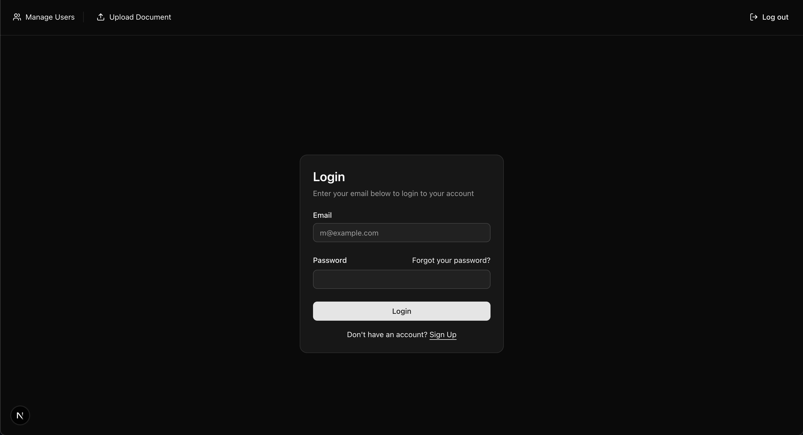
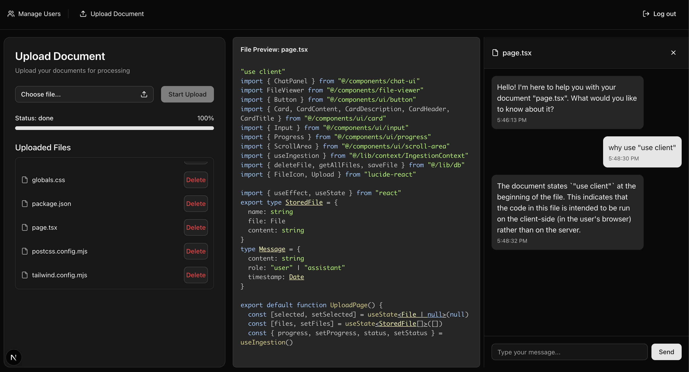
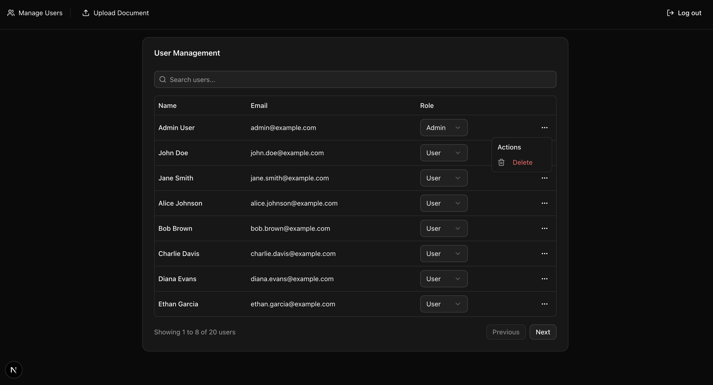

# JK Tech – File-Based Chat App with Admin Dashboard

Welcome to **JK Tech**, a powerful full-stack web app that enables users to upload text-based files and interact with their content through an AI chat interface. The app also includes a user management system for admin use.

Built with the latest web technologies including **Next.js 15**, **React 19**, and **Tailwind CSS**, this app prioritizes performance, clarity, and ease of use.

---

## 🔧 Tech Stack

- **Framework**: Next.js (App Router, TypeScript)
- **Frontend**: React 19, Tailwind CSS, Radix UI
- **Table Management**: @tanstack/react-table
- **File Storage**: IndexedDB (via `idb` library)
- **AI Integration**: Gemini API (Google) for file-related Q&A
- **Testing**: Playwright (E2E automation)

---

## 🖼️ Features

- Upload local `.txt`, `.pdf`, or other text-readable files (stored in IndexedDB)
- Real-time chat with AI (specific to the uploaded file)
- Admin dashboard for user management (role updates, user deletion)
- Full Playwright test suite for login, logout, upload, Q&A, and user management

---

## 🚀 Getting Started

### 1. Clone the Repository

```bash
git clone https://github.com/your-username/jk-tech.git
cd jk-tech
```

### 2. Install Dependencies:

```bash
npm install
# or
yarn install
```

### 3. Create a .env.local file in the root directory and add the following:

```js
# Gemini API Key (Free Tier Supported)
GEMINI_API_KEY=your_gemini_api_key_here
```

### 4. Start the Development Server

```js
npm run dev
```

### 5. Mock users

```js
#admin
Email : admin@example.com
Password : admin123

# user
Email: user@example.com
Password: password123
```

## 🧪 Running Tests (Playwright)

### This app uses Playwright for end-to-end UI testing.

### 1. Install Playwright Browsers

```bash
npm init playwright@latest
```

### 2. Run Tests

```bash
npx playwright test
```

### 3. To run tests with the UI visible (headed mode)::

```bash
npx playwright test --headed
```

## 📜 Available Scripts

```bash
npm run dev        # Start the local dev server
npm run build      # Build the app for production
npm run start      # Run the production server
npm run lint       # Lint the codebase
npx playwright test  # Run all automated Playwright tests

```

### 📸 Screenshots

## Login



## Upload Files and Chat with AI



## User Management


